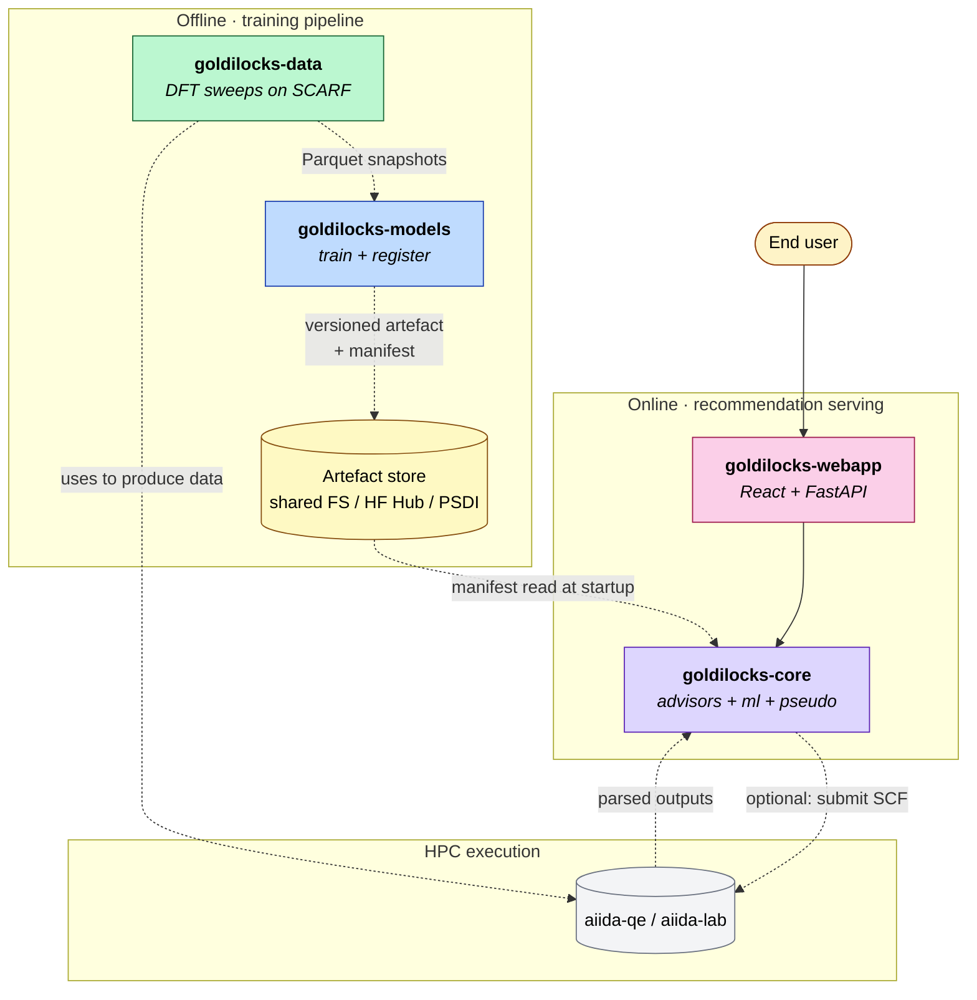
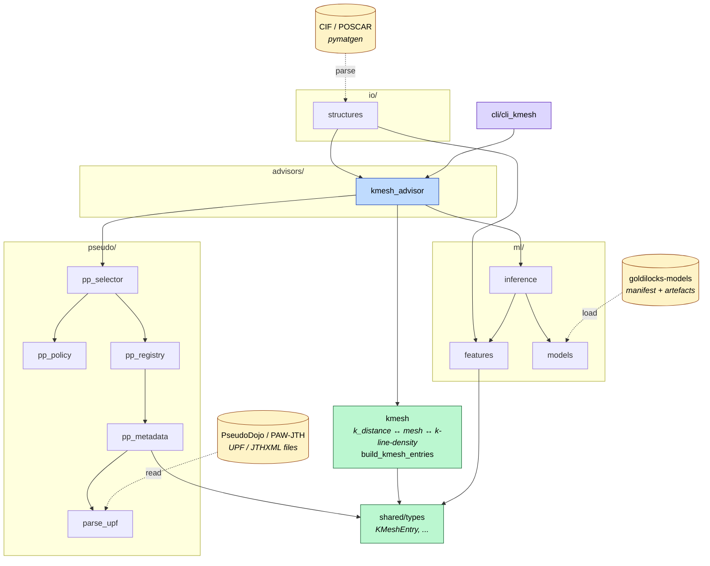
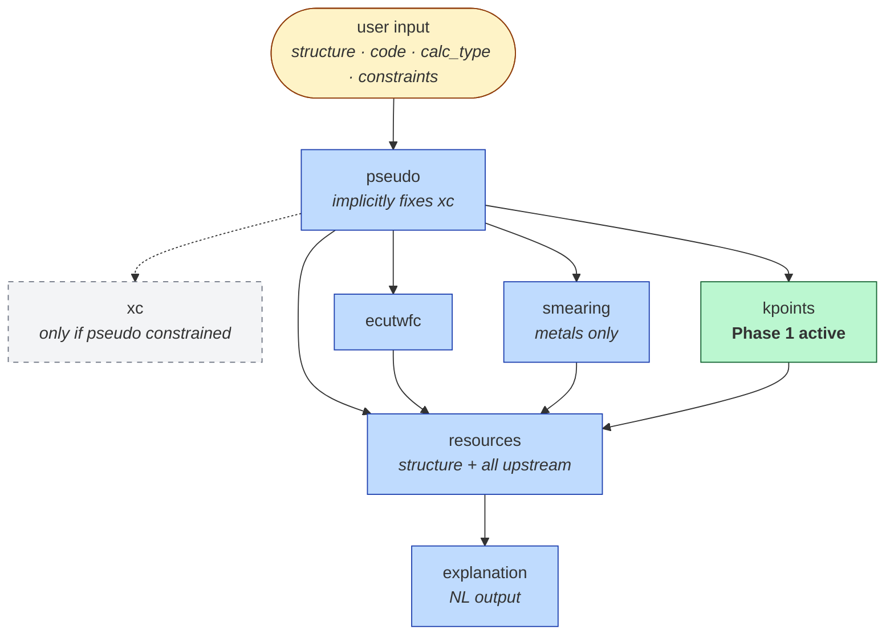

# Architecture

## Overview

`goldilocks-core` is a research-grade Python package for recommending and organizing DFT calculation inputs from crystal structures, parsed pseudopotentials, and machine-learning models.

The package is being organized around domain-focused modules rather than generic utility buckets. The goal is to keep scientific parsing, physical metadata extraction, model inference, recommendation policy, and user-facing interfaces clearly separated.

At the current stage, the package has two main vertical slices:

- k-mesh recommendation from structure-aware logic and ML-predicted `k_index`
- pseudopotential parsing and local registry construction from UPF files

These slices are designed to remain composable so that future recommendation workflows can combine structure, task, code, k-mesh policy, and pseudopotential choice in a clean way.

## Ecosystem context

`goldilocks-core` is one of four sibling repositories under the UKRI Goldilocks programme (EP/Z530657/1). The system is split into an **offline** training pipeline (`goldilocks-data` → `goldilocks-models` → artefact store) and an **online** recommendation path (`goldilocks-webapp` → `goldilocks-core` → loaded manifests). Core sits on the online path and reads the manifests written by the offline path; the two paths only meet at the shared artefact store, so the offline pipeline does not need to be running for the online recommendation to be served.



Note that `goldilocks-data` also imports parts of this package (`kmesh.build_kmesh_entries`, `pp_selector`, `infer_features`) when building its sweeps, so there is a hard Python dependency from data → core in addition to the artefact-flow direction shown above.

## Design Principles

- Prefer domain-oriented modules over generic buckets such as `helpers` or `processing`.
- Keep low-level scientific parsing separate from recommendation policy.
- Keep command-line interfaces thin and delegate real work to package APIs.
- Use explicit dataclasses for stable internal interfaces.
- Favor small focused functions over large mixed-responsibility scripts.
- Make the package testable without depending on private local datasets whenever possible.
- Support notebook exploration, but treat package modules and tests as the source of truth.
- Evolve incrementally while keeping tests passing during refactors.

## Current Package Layout

```text
src/goldilocks_core/
├── advisors/
├── cli/
├── io/
├── kmesh.py
├── ml/
├── pseudo/
└── shared/
```

### Package dependencies

Solid edges are `import` dependencies between subpackages; dashed edges are data / artefact flows in or out of the package. External boundaries are inputs from CIF / POSCAR files and from `goldilocks-models` artefacts.



The two vertical slices mentioned in the Overview map cleanly onto the diagram: the k-mesh slice is the `advisors → ml + kmesh` path, and the pseudopotential slice is `advisors → pseudo/` and `pseudo/ → parse_upf ← UPF files`. `shared/types` is the common type layer both slices reach into.

## Module Roles

### `advisors/`

This layer coordinates recommendation workflows and applies policy decisions.

It should answer questions such as:

- given a structure and model, which recommendation should be returned
- how should model output be mapped onto a domain object
- how should task- or code-specific rules affect the final recommendation

Current example:

- `kmesh_advisor.py` maps predicted `k_index` values onto concrete `KMeshEntry` objects and returns `KPointsAdvice`

This layer should remain orchestration-oriented rather than becoming a place for low-level parsing or geometry logic.

### `cli/`

This layer exposes package functionality to users through command-line entry points.

Its responsibilities are:

- parse arguments
- load inputs
- call package APIs
- print results

The CLI should remain thin. It should not duplicate k-mesh or pseudopotential logic.

### `io/`

This layer handles structure input and normalization.

Typical responsibilities include:

- loading structure files
- validating supported input formats
- converting user inputs into `pymatgen.Structure` objects

This replaces the older practice of placing structure loading code under a generic helper namespace.

### `kmesh.py`

This is a top-level domain module for k-mesh generation and analysis.

It contains structure-driven logic such as:

- converting `k_distance` into a k-mesh
- generating candidate `k_distance` values
- constructing k-distance intervals
- building indexed `KMeshEntry` objects
- computing mesh metadata such as `k_pra`
- computing reduced k-point counts
- inferring line-density intervals when meaningful

This module should stay as neutral as possible:

- it should depend on structure, symmetry, and reciprocal-space geometry
- it should not hard-code task-, code-, or pseudo-specific recommendation policy

### `ml/`

This layer contains machine-learning support utilities.

Current responsibilities include:

- CSLR feature extraction
- model loading
- model inference

The ML layer should predict abstract targets such as `k_index`, rather than directly formatting final code-specific recommendations.

### `pseudo/`

This package contains pseudopotential-specific logic.

Current responsibilities include:

- parsing UPF files into structured metadata
- handling both attribute-style and text-style `PP_HEADER`
- extracting additional metadata from `PP_INFO`
- constructing local pseudopotential registries
- filtering registries by element

This package is expected to grow further to include:

- local pseudo library indexing
- pseudo selection for a structure
- electron-count and related derived metadata
- code-specific pseudo configuration
- optional download and installation utilities

### `shared/`

This layer contains reusable data models and shared type definitions used across the package.

Examples include:

- `KMeshEntry`
- `KPointsAdvice`
- `ModelSpec`
- `StructureFeatureVector`
- `StructureAnalysis`

This layer exists to keep shared interfaces explicit and stable.

## K-Mesh Recommendation Stack

The current k-mesh recommendation stack follows this flow:

1. A `pymatgen.Structure` is converted into a CSLR feature vector.
2. A trained ML model predicts a `k_index`.
3. Candidate k-distance values are generated from the reciprocal lattice.
4. These candidates are converted into `KMeshEntry` objects.
5. The predicted `k_index` is mapped onto one selected entry.
6. The selected entry is converted into a user-facing `KPointsAdvice`.

This design keeps responsibilities separate:

- `ml/` handles prediction
- `kmesh.py` handles k-mesh space construction
- `advisors/` handles final recommendation selection

## Pseudopotential Stack

The current pseudopotential stack follows this flow:

1. A UPF file is read as text.
2. The parser detects whether `PP_HEADER` is attribute-style or text-style.
3. Header metadata is parsed into a normalized internal dictionary.
4. Supplemental information is extracted from `PP_INFO` when needed.
5. Core metadata is promoted into `PseudoMetadata`.
6. A local root directory can be scanned into a list of parsed metadata entries.
7. Registry-level helpers can filter this list, for example by element.

Important design rules for this stack:

- `element` may fall back to filename parsing when needed
- `functional`, `pseudo_type`, `relativistic`, and `z_valence` should preferentially come from UPF content rather than filename heuristics
- filename hints are useful, but header metadata is treated as authoritative when the two disagree

This is especially important because real-world pseudo libraries contain historical naming inconsistencies.

## Multi-task Recommendation Orchestration

The k-mesh stack and the pseudopotential stack above are two of several per-target recommendation slices that `goldilocks-core` brings together at recommendation time. The slices are not independent: pseudopotential choice affects every downstream parameter (ecutwfc convergence is pseudo-specific; smearing depends on DOS at E_F which depends on pseudo; the k-mesh convergence label is computed for a given pseudo). Core walks a directed acyclic graph of these slices to produce a coherent recommendation.



Reading the DAG:

- Solid edges are **feature dependencies**. The downstream task's ML model was trained with the upstream target's value as an input feature column, so the upstream prediction must be available before the downstream model can be called.
- The dashed edge `pseudo -.-> xc` is **conditional**. PseudoDojo / PAW-JTH families commit to a specific exchange-correlation functional, so picking a pseudo also fixes XC by construction. The `xc` slice only fires when the user constrains pseudo upstream and asks for an XC recommendation under that constraint.

Walking the DAG at recommendation time:

1. Inspect the user input. The four input dimensions (`structure`, `code`, `calc_type`, optional `user_constraints`) determine which slices are even relevant. Phase 1 locks `code = QE`, `calc_type = SCF`.
2. Resolve `pseudo`. Either run the pseudo-selection model (when `goldilocks-models tasks/pseudo` is trained, Phase 1.5 onwards), or apply the rule-based selector in `pseudo/pp_selector` (Phase 1 default).
3. Resolve `ecutwfc`, `smearing`, `kpoints`. Each takes the structure plus the resolved pseudo as input. In Phase 1 only the `kpoints` model is trained (via `advisors/kmesh_advisor` calling `ml/inference`); the others fall back to defaults (`ecutwfc` from the PseudoDojo recommended cutoffs, `smearing` from a metallicity heuristic + the chosen pseudo).
4. Resolve `resources` if a wallclock / RAM / ntasks estimate is needed. This is the leaf of the DAG and consumes every upstream resolution as a feature.
5. Optionally generate `explanation` via the LLM-class explainer model.

Per-model manifests declare their upstream feature dependencies via the `dependencies.upstream_targets` field. Core reads these manifests at load time and refuses to use a model whose declared dependencies are not yet resolvable.

In Phase 1, only `kpoints` has a trained model. Every other slice runs from a heuristic or a fixed default until the corresponding sweep lands in `goldilocks-data` and a model is trained and registered by `goldilocks-models`. Core's orchestration code is written against the manifest interface, so swapping a heuristic for a real model later is a configuration change rather than a code change.

This DAG is the canonical orchestration model for the Goldilocks system. Mirror copies in `goldilocks-models/docs/PLAN.md` §4.2 and the ecosystem overview (`goldilocks-ecosystem/docs/architecture.md`) should track this version when the orchestration changes.

## Data Model Strategy

The package uses explicit dataclasses for stable internal interfaces.

This has several goals:

- make boundaries between modules easy to understand
- keep field names explicit
- reduce hidden assumptions about ordering or shape
- make testing easier
- make notebook exploration more structured

The rule of thumb is:

- shared, stable interfaces belong in `shared/`
- domain-specific structured metadata belongs near the domain module that owns it

For example:

- `KMeshEntry` belongs to the general shared model layer because it is used across recommendation logic
- `PseudoMetadata` belongs in `pseudo/` because it is specifically tied to pseudopotential parsing and registry work

## Testing Strategy

The package uses two complementary testing styles.

### Unit and package tests

These are the primary tests and should be:

- portable
- deterministic
- runnable in CI
- independent of private local data when possible

Examples:

- synthetic UPF snippets under `tmp_path`
- synthetic pseudo directory trees for registry tests
- small structure fixtures for k-mesh tests

### Local exploratory validation

Notebook exploration and local data scans are still important, especially for research-oriented parsing work.

These are useful for:

- validating behavior against large local pseudo libraries
- checking unusual real-world file patterns
- identifying normalization mistakes
- guiding new regression tests

However, notebook experiments should be converted into focused tests once a behavior is understood and stabilized.

## Documentation Strategy

The project should document three layers clearly.

### Architecture documentation

This document explains:

- why the package is structured the way it is
- what each module owns
- how data flows across the package

### User-facing documentation

The README and future usage guides should help a new user answer:

- what can this package currently do
- how do I use the Python API
- how do I use the CLI
- what input data do I need

### Developer-facing documentation

Module docstrings and tests should make it easy for a future contributor to understand:

- what a function is responsible for
- what assumptions it makes
- what output shape it guarantees
- what cases are already covered by tests

## User Onboarding Goals

The package should become easy to approach in three ways.

### Python-first usage

A user should be able to do things like:

- load a structure
- ask for k-mesh advice
- parse a UPF file
- build a local pseudo registry

without needing to understand the entire package internals.

### CLI-first usage

A user should be able to run a small number of focused commands for common tasks, such as:

- recommending a k-mesh for a structure
- scanning a pseudo library
- inspecting parsed pseudo metadata

### Notebook-first exploration

A research user should be able to import the same package APIs into notebooks and inspect intermediate objects without relying on hidden notebook-only logic.

## Current Strengths

At the current stage, the package already has several strong foundations:

- explicit k-mesh recommendation flow
- shared typed data models
- thin advisor layer for ML-driven k-mesh selection
- initial CLI entry point
- real UPF parsing against multiple pseudo libraries
- local pseudo registry loading and filtering
- tests built from both synthetic fixtures and real local validation

## Near-Term Priorities

The next architectural priorities are:

- improve pseudopotential registry capabilities beyond simple loading and element filtering
- add pseudo selection logic based on structure, code, and task
- add derived electronic metadata from selected pseudos
- design a clear user-facing workflow for local pseudo download and installation
- keep the CLI thin while expanding Python-level APIs first
- continue improving normalization logic only when backed by real pseudo-library evidence

## Migration Direction

The package has already moved away from generic buckets such as `helpers/` and `processing/`.

The ongoing direction is:

- keep top-level domains explicit
- let `kmesh.py` own k-mesh construction
- let `pseudo/` own pseudopotential parsing and registry logic
- let `advisors/` own recommendation orchestration
- let `cli/` expose a thin user interface
- keep shared interfaces centralized in `shared/`

This staged approach reduces refactor risk while allowing the package to keep growing in a research-grade but maintainable way.
