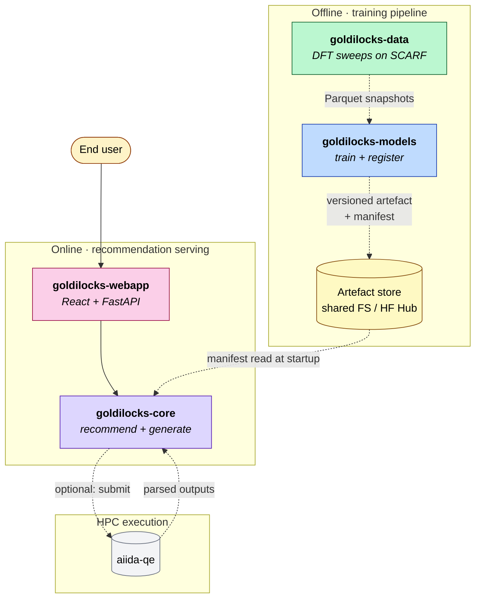

# Architecture

## Ecosystem

`goldilocks-core` is the recommendation engine in a four-repo pipeline. It sits on the **online** path and reads artefacts produced by the **offline** training pipeline.



`goldilocks-models` imports two **stable** APIs from this package — do not change without retraining:

- `goldilocks_core.kmesh.build_kmesh_entries`
- `goldilocks_core.infer_features`

## Pipeline

```
Load → Analyse → Advise → Select → Generate
```

| Stage | Input → Output | Module |
|-------|---------------|--------|
| Load | file path → `Structure` | `io/structures.py` |
| Analyse | `Structure` → `StructureAnalysis` | `analyse/structure.py` |
| Advise | `StructureAnalysis` + `CalculationIntent` → `AdviceBundle` | `advise/pipeline.py` |
| Select | `AdviceBundle` → `QEParameterSet` | `select/qe.py` |
| Generate | `QEParameterSet` + `Structure` → input files | `generate/qe.py` |

**Rules:**
- Stages are a strict sequence — no stage reads back from a later one.
- Advise produces code-agnostic decisions; Select is the only code-aware stage.
- Analyse reports facts only; all parameter recommendations live in Advise.

## Design Principles

- Domain modules, not generic buckets. No `helpers/`, `utils/`, or `processing/`.
- Every parameter decision in `advise/` carries a `provenance` field (`heuristic` / `ML` / `user_hint`) and a `rationale` string.
- ML models are loaded from manifests, never hard-coded. Swapping a heuristic for a trained model is a config change, not a code change.
- Optional extras (`aiida`, `mlip`) degrade gracefully — types are importable without the heavy deps installed.
- CLI is thin. It parses arguments, calls package APIs, and prints results. No DFT logic lives in `cli/`.

## Module Responsibilities

| Module | Owns |
|--------|------|
| `intent.py` | `CalculationIntent`, `ParameterHints` — shared input to all stages |
| `kmesh.py` | k-spacing ↔ mesh maths, `KMeshEntry`. 🔒 Stable API. |
| `io/` | Structure file parsing; OPTIMADE database search |
| `analyse/` | `StructureAnalysis`: metallicity, magnetic, SOC, dimensionality, disorder |
| `advise/` | One submodule per parameter group; `types.py` holds all decision dataclasses |
| `select/qe.py` | `AdviceBundle` → `QEParameterSet` (QE-specific values) |
| `generate/qe.py` | `QEParameterSet` → `gl-pw-scf.in` / `gl-ph.in` |
| `pseudo/` | UPF parsing, local pseudo registry, policy evaluation |
| `ml/` | Feature extraction (`infer_features` 🔒), model loading, inference |
| `ml/kpoints/` | Advanced ML backends: CGCNN + QRF, ALIGNN |
| `data/` | Bundled pseudopotentials and ML model artefacts |
| `results/` | Parse QE output, validate against manifest, plot bands/DOS |
| `aiida/` | AiiDA workflow integration (`goldilocks[aiida]`) |
| `mlip/` | MACE-based pre-analysis (`goldilocks[mlip]`) |
| `cli/` | `gl` wizard + `gl input` command (Typer / Rich) |

## Testing Strategy

- Tests are portable and deterministic; no private local data.
- Tests that require a local pseudo library or model artefacts are marked `skip` with a clear message.
- `uv run pytest` runs the full suite; `uv run pre-commit run --all-files` runs lint + tests together.
