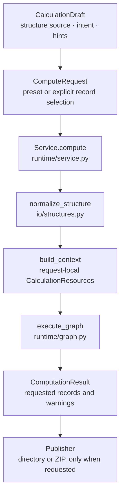
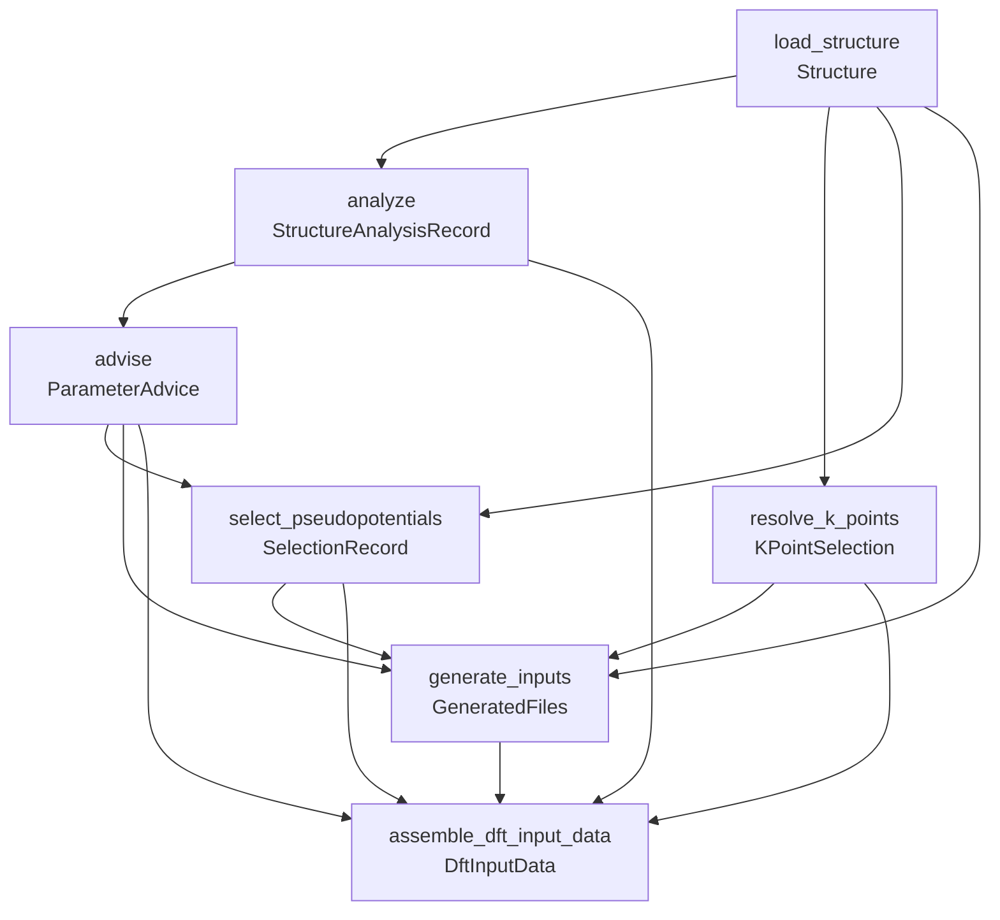

# Architecture

Core turns a crystal structure and a calculation intent into ready-to-run DFT
input. A request states the structure, the calculation, and which records the
caller wants; the package computes them as a graph of stages and can publish
the assembled input as a directory or ZIP. This page describes the control
flow, the built-in stage graph, and where code lives. Build setup, checks, CI,
and releases are in [Contributing](contributing.md); the browser app is
described in the [Workbench guide](../web/README.md).

## Control flow


```mermaid
flowchart TD
    draft["CalculationDraft<br/>structure source · intent · hints"] --> request["ComputeRequest<br/>preset or explicit record selection"]
    request --> service["Service.compute<br/>runtime/service.py"]
    service --> normalize["normalize_structure<br/>io/structures.py"]
    normalize --> context["build_context<br/>request-local CalculationResources"]
    context --> execute["execute_graph<br/>runtime/graph.py"]
    execute --> result["ComputationResult<br/>requested records and warnings"]
    result --> publish["Publisher<br/>directory or ZIP, only when requested"]
```

1. The caller builds a `CalculationDraft` — structure source, calculation
   intent, overrides, hints — and pairs it with a record selection: either a
   preset (`recommend`, `generate`) or an explicit set of record types.
2. `Dispatcher.compute` finds the handler registered for the task, resolves the
   requested outputs, and validates the selection against the task's
   `selectable_outputs`.
3. `normalize_structure` runs the source through the same path used by
   inspection. The result carries the normalized inspection, not the raw
   source.
4. The handler's `build_context` builds a request-local context — model
   backends, pseudopotential source — from the request, the normalized
   structure, and the shared `Runtime`.
5. `execute_graph` resolves the requested outputs to stages, runs each stage
   once in dependency order, and memoizes outputs. Cycles and missing
   producers are rejected before any stage runs.
6. `Dispatcher` assembles a `ComputationResult` holding only the requested
   records plus warnings collected from the executed stages.
7. If the caller passed an output target, `Service` publishes and attaches
   publication metadata. Python calls publish nothing by default. CLI and MCP
   default to an output directory; HTTP keeps the result in memory and returns
   archive bytes separately.

## The built-in stage graph

`runtime/scf.py` declares `scf_single_point`. Each stage is a plain function
with declared input and output types. In the diagram, an arrow points from a
stage to a stage that consumes its output record.

- `load_structure` — the normalized source as a pymatgen `Structure`.
- `analyze` — structure facts and estimated electronic character.
- `resolve_k_points` — the k-point grid, from operator hints or a model.
- `advise` — provenance-backed calculation parameters.
- `select_pseudopotentials` — one pseudopotential per element.
- `generate_inputs` — target-code input files.
- `assemble_dft_input_data` — complete trusted input data for publication.


```mermaid
flowchart TD
    load["load_structure<br/>Structure"] --> analyze["analyze<br/>StructureAnalysisRecord"]
    load --> kpoints["resolve_k_points<br/>KPointSelection"]
    load --> select["select_pseudopotentials<br/>SelectionRecord"]
    analyze --> advise["advise<br/>ParameterAdvice"]
    advise --> select
    load --> generate["generate_inputs<br/>GeneratedFiles"]
    advise --> generate
    kpoints --> generate
    select --> generate
    analyze --> assemble["assemble_dft_input_data<br/>DftInputData"]
    advise --> assemble
    kpoints --> assemble
    select --> assemble
    generate --> assemble
```

- `recommend` returns the analysis, advice, k-point, and selection records.
- `generate` additionally runs `generate_inputs` and `assemble_dft_input_data`
  and returns all six records.
- Explicit selection can request any subset of `selectable_outputs`; the graph
  runs only the stages those records need.

Stage outputs are typed values in a request-local dictionary; scientific
records are plain dictionaries described by domain-owned `TypedDict` shapes.
Warning collection inspects intermediate outputs after execution.

## Modules

Paths are relative to `src/goldilocks_core/` unless stated otherwise.

| Area                | Files and responsibility                                                                                                                                                                                                               |
| ------------------- | -------------------------------------------------------------------------------------------------------------------------------------------------------------------------------------------------------------------------------------- |
| Python contracts    | `calculation.py`, `request.py`, `result.py`: validating input dataclasses and computation results.                                                                                                                                     |
| Execution           | `runtime/graph.py`: dependency traversal; `runtime/dispatch.py`: `GraphHandler`, registration, and result assembly; `runtime/scf.py`: built-in graph.                                                                                  |
| Service lifecycle   | `runtime/service.py`: reusable native and document operations, one-call convenience, and expected-failure classification; `runtime/models.py`: shared model lifecycle and request-local model resolution.                              |
| Input and discovery | `io/structures.py`: source normalization and inspection; `runtime/capabilities.py`: available tasks, models, tables, and defaults; `runtime/registry.py`: stable record IDs.                                                           |
| Scientific behavior | `analysis.py`, `advice/`, `kmesh/`, `selection.py`: facts, recommendations, grids, and pseudopotential selection.                                                                                                                      |
| Assets              | `assets/`: installation and integrity; `ml/models.py`: model declarations; `pseudo/registry.py` and `pseudo/import_*`: table declarations and provider normalization; `pseudo/source.py`: selection and deferred publication material. |
| Output              | `generation/`: target-code writers; `input_data.py`: complete input assembly; `publication.py`: directory and ZIP layout; `serialization.py`: JSON projections.                                                                        |
| Transports          | `cli/core.py`: local commands; `server/documents.py`: strict native request conversion and derived response schemas; `server/http.py` and `server/mcp.py`: adapters; `server/readiness.py`: cached asset checks; `server/workers.py`: HTTP worker planning.                       |
| Browser             | Repository `web/src/api/`: HTTP client and generated types; `web/src/workspace/`: draft, request, result, and download state.                                                                                                          |

## Extend a workflow

### Add a task or stage

Use `runtime/scf.py` as the working example. Define a `TaskGraph` with stages,
presets, selectable outputs, and stable IDs for new record types. Wrap it in a
`GraphHandler` providing `build_context` and `collect_warnings`, then pass it
through `Service(task_handlers=(handler,))`.

A stage declares its input types, output type, and callable. The executor passes
dependency values positionally and the task context as `ctx`. It rejects
duplicate producers when constructing a graph, and missing producers or cycles
when resolving requested outputs. Task registration also checks stage IDs,
preset names, and record IDs.

Add task-specific dependencies to the context, not the generic executor.
Explicit task registration takes precedence over the lazily registered SCF
default. Transport-facing records need domain-owned shapes and portable field
annotations; registering a record ID alone does not define its public schema.

### Add an input writer

Implement the writer in `generation/` and register its `(code, task, writer)`
entry in `generation/registry.py`. Writers receive the structure and completed
advice, selection, and k-point records, and return file documents with path,
content, and role. They should reject unsupported combinations before rendering,
rather than inventing scientific choices. The current registry contains the
Quantum ESPRESSO SCF writer.

### Add a model or pseudopotential table

Keep scientific metadata and provider-specific preparation in the model or
pseudopotential registry. `AssetStore` handles acquisition, integrity,
installation, and verified path resolution. `pseudo/source.py` resolves explicit
metadata, a local root, or a compatible installed table; the selection function
consumes the resulting metadata.

Model backends load installed files lazily. Missing optional metallicity assets
permit a heuristic fallback; missing required assets raise an asset error.
Scientific operations do not install assets. Installation is explicit through
asset commands or the CLI's `--fetch-missing` retry. See
[pseudopotential tables](pseudopotentials.md) for layout and licensing
requirements.

Independent assets install concurrently with at most eight workers. Results
retain profile order; each asset retains its own lock, checksum verification,
staging directory, and atomic publication.

`CalculationResources` binds request-local pseudo and model resolutions.
Selection-only computations do not read publication content. For complete input
data, resolvers supply verified byte snapshots and exact metadata; assembly
combines these with completed records rather than rediscovering sources.

## Preserve the boundaries

- **Validate at entry and side effects.** Input constructors validate domain
  controls; transport models reject unknown fields and incorrect types; provider
  adapters validate imported data. Internal stage documents are trusted, so
  custom stages must return coherent values.
- **Keep execution state request-local.** Graph declarations are frozen
  dataclasses, but record dictionaries are mutable. Do not share or mutate a
  previous request's records. HTTP requests can overlap over one runtime;
  backend locks protect lazy initialization rather than serializing complete
  computations. Close or reset the runtime only after its callers have finished.
  Model configuration is cached for each backend's lifetime; reset releases
  loaded model resources without rereading configuration.
  Publication uses the identity and legal references cached with each loaded
  model, not a fresh registry read. The QRF feature classifier and standalone
  metallicity classifier retain separate snapshots. Unused models are not
  loaded for publication.
- **Respect resource ownership.** A service closes the runtime it creates, not a
  runtime supplied by its caller. Optional HTTP and MCP libraries load at their
  transport boundaries rather than on `import goldilocks_core`.
- **Preserve record IDs.** Python results use type keys; portable results use
  stable string IDs. `to_jsonable` provides the complete representation, while
  `to_portable` applies record-specific projections for publication and
  transport output.
- **Publish through one implementation.** Resource resolvers verify external
  files and snapshot their bytes; publication never rereads the asset store.
  `Publisher` validates logical paths, hashes each file once for `goldilocks.json`,
  and builds matching directory and ZIP contents. Private staging and a
  no-replace rename protect existing destinations, not against a hostile process
  controlling the destination parent. Generated input files alone are insufficient
  for publication.
- **Keep remote callers away from local paths.** HTTP and MCP accept inline
  structures and registered table IDs, not filesystem sources, model locations,
  or publication paths. Keep authentication and deployment controls explicit;
  see [CLI transport security](cli.md#http-security).
- **Keep imports direct.** Package code imports from the module defining a name.
  The top-level `goldilocks_core` exports are for library users.
- **Classify expected failures once.** Domain exceptions implement
  `ExpectedFailure` from `failures.py` with a category and safe public description.
  Native operations retain exception identities; document operations classify
  failures for adapters. Unexpected execution defects propagate.

## Change the HTTP or browser contract

`server/documents.py` converts strict request models directly into native Core
inputs and derives response schemas from domain-owned shapes and `Portable`
annotations. Document operations serialize trusted Core results without
reconstructing response models. HTTP packages result JSON and its optional ZIP;
MCP can request automatic directory publication or memory-only output.
Workbench reads file hashes and sizes from the ZIP's `goldilocks.json`.

Each transport owns one service unless a caller injects one. Loaded models and
cached asset-readiness reports are reused across requests.

Workbench keeps the editable draft and reviewed response in its browser store.
Editing a draft marks the existing result out of date and prevents downloading
its archive. Download uses the bytes returned with that result rather than
recomputing it.

After changing the wire contract, run these from the repository root with the
HTTP extra installed:

```bash
npm --prefix web run generate:api
```

`web/openapi.json` and `web/src/api/schema.d.ts` are ignored build products.
Frontend lifecycle commands regenerate them from the local Python package;
generation needs neither a running server nor installed model assets. Commit
the domain declarations, not generated copies. Docker exports OpenAPI in its
Python stage and generates TypeScript in its Node stage.
