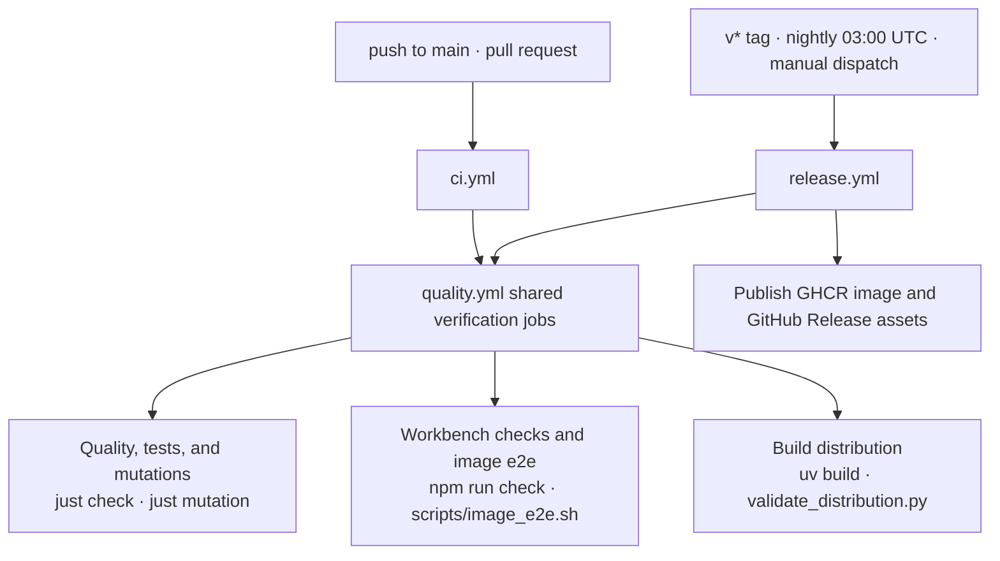

# Contributing

This page covers repository setup, the checks that gate a contribution, and how
releases are cut. For the code map and extension points, read
[Architecture](architecture.md).

## Set up a contribution

From the repository root:

```bash
uv sync --group dev
uv run pre-commit install
uv run just check
```

`just check` runs Ruff lint, format, and complexity checks, then pytest with
branch coverage. Use `uv run just fmt` to apply Python formatting. The commit
hooks run the same lint and complexity checks. For frontend checks and
API-schema refresh, follow the [Workbench guide](../web/README.md).

## CI gates and workflows



Every check has one canonical entry point: a `just` recipe for Python gates, an
npm script for frontend checks, and a Python script under `scripts/` for release
gates. Workflows call the same entry points that local development uses; check
recipes are not inlined in workflow YAML.

| Entry point | Checks |
| --- | --- |
| `just lint` | Ruff lint and format; complexity ceilings |
| `just test` | pytest with branch coverage |
| `just check` | `lint`, then `test`; the pre-PR gate |
| `just mutation` | focused mutation testing against the score gate |
| `just dist` | sdist and wheel build into a fresh directory, then content validation |
| `just web-check` | Workbench lint, unit tests, and production build |
| `just image-e2e` | production image build, boot, and Playwright e2e (needs Docker) |
| `just bump <target>` | version bump in `pyproject.toml` plus `uv.lock` refresh |

`.github/workflows/quality.yml` defines the shared verification jobs and holds
no triggers itself. Two workflows call it:

- `ci.yml` runs on pushes to `main` and on pull requests. Its concurrency group
  cancels a superseded run on the same ref.
- `release.yml` runs on `v*` tags, the nightly schedule at 03:00 UTC, and manual
  dispatch. It runs the same quality jobs, then publishes. Its concurrency group
  serializes releases and never cancels one mid-flight.

The quality jobs run `just check` and `just mutation`; `npm run check` plus the
image e2e through `scripts/image_e2e.sh`; and the distribution build and
validation. The distribution job runs `uv build` and the validator directly so
it never syncs the development environment. Pre-commit runs the fast gates only:
Ruff and the complexity ceilings.

`scripts/` holds the Python gates the recipes and workflows call:
`check_complexity.py` (import and cyclomatic ceilings), `check_mutation_score.py`
(the enforced score and the CI step summary), `validate_distribution.py` (wheel
and sdist contents), `check_release_tag.py` (tag equals the `pyproject.toml`
version), `bump_version.py` (version bump and relock), and
`export_workbench_openapi.py` (HTTP contract export for the Workbench and the
image build). Published artifacts are described under
[Cut a release](#cut-a-release).

## Cut a release

One version covers the repository: `pyproject.toml` owns it, and the Workbench
frontend ships inside the same image rather than carrying its own version.
Treat API/schema changes (the OpenAPI export) as at least a minor bump during
`0.x`; frontend-only fixes can be patches.

To publish, bump the version with `uv run just bump patch` (or `minor`,
`major`, or an explicit `X.Y.Z`); the recipe edits `pyproject.toml`, refreshes
`uv.lock`, and prints the tag to use. Commit the bump in a release PR, then
from `main`:

```bash
git tag -a v0.2.1 -m "v0.2.1"
git push origin v0.2.1
```

The release workflow runs the full suite on the tagged commit, checks that the
tag equals the `pyproject.toml` version, then pushes
`ghcr.io/stfc/goldilocks-workbench` with `X.Y.Z`, `X.Y`, `X`, and `latest` tags,
and creates a GitHub Release containing the sdist and wheel. Nightly builds of
`main` publish `nightly` and `nightly-<date>` image tags at 03:00 UTC; PRs and
plain `main` pushes publish nothing. The first publish creates the
container package private; flip it to public once in the package settings so
anonymous pulls work.

## Complexity gates

`scripts/check_complexity.py` runs in contributor checks, hooks, and CI. Its AST
import ceiling applies to every production owner: 12 project origin modules and
24 imported symbols, with stricter limits for CLI, HTTP, MCP, assembly, and SCF.
It counts local and type-only imports, resolves re-exports, and counts accessed
module-alias members. Pure export packages are transparent to consumer counts.
The same gate runs Ruff's McCabe check: at most 10 per production function,
ignoring `noqa` suppressions. Reduce decisions and duplication; moving import
blocks or extracting shallow helper fleets does not deepen an interface.
